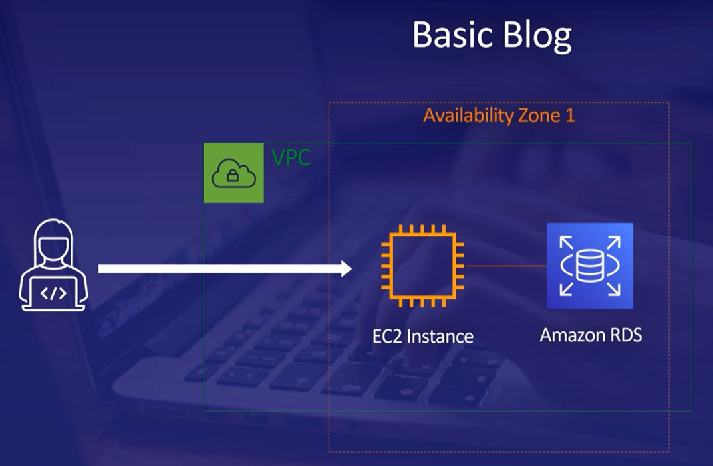
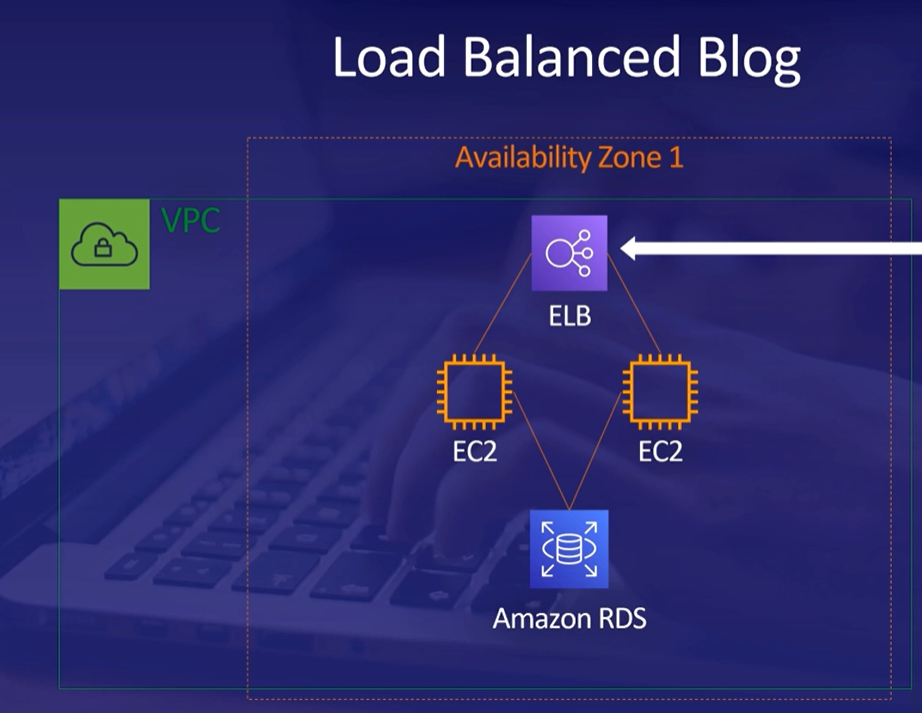
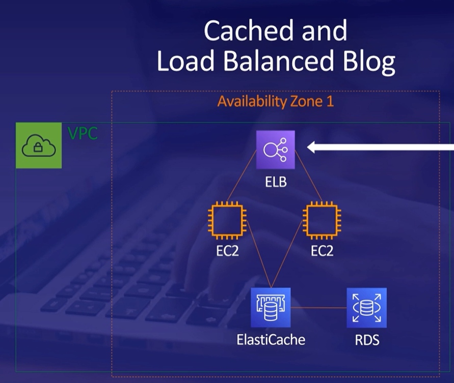
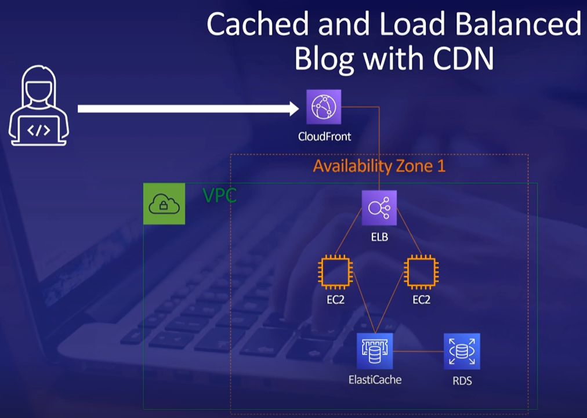

# AWS-Learning-Progress

## Day 1:

> Introduction
- What's a cloud? A collection of services (databases, virtual servers, etc) that creates a platform.
- The AWS has pay-as-you-go pricing.
- AWS Services

> Security and Identity
- AWS Identity Access Management (IAM), AWS Secrets Manager protects the secrets required, and Directory Service provides the directories for the org with specific users.
- IAM Practice Lab
1. For this lab there is an AWS account, inside of IAM there are different groups such as Admin, Developers, and Test. Each group has a certain set of permissions.
2. Three users have already been created and we can check them in the **Users Tab**, three groups were created previously named EC2-Admin, EC2-Support, and S3-Support which can be seen under **User groups Tab**.
3. The EC2-Admin has an inline policy (has permissions to describe, start, and stop EC2 instances | also a few metrics). The EC2-Support group has managed policy (has permissions to describe EC2 instances and list cloud metrics). The S3-Support has managed policy (has permissions of read-only access such as get, list, and describe objects.)
4. So now we have 3 users (U1, U2, U3) and we are going to assign these users to the above groups. First, assign the U1 to the S3-Support group (**Process: Click on the S3-Support group, click on the Add Users button, select the U1, and then click on Add Users**). Then we are going to do the same for the U2 and U3. Add the U2 to the EC2-Support group and the U3 to the EC2-Admin group.
5. We can edit the permissions of any user (**Process: Click on the user, under the permissions tab expand the policy, and click on the edit**).
6. To demonstrate these permissions, **go to the dashboard copy the sign-in URL paste it into a new tab, and log in as U1. To check permissions click on S3 and click on create bucket, it fails since U1 does not have permissions and this goes the same with EC2 since U1 has read-only permissions**.
7. Similarly we log in as U2, here when we click on EC2 and click on instances it works and has more permissions than U1, but when we try to stop that instance it fails. U2 also cannot create or view the buckets.
8. log in as U3, head over to EC2, and if we try to stop the instance it stops since U3 is in the group EC2-Admin. 

## Day 2:

> Elastic Compute Cloud (EC2)
- It is a service that allows to rent virtual computers (option to choose various specifications). Everything is an instance. For example, a task that takes 24 hours can be broken down into 24 1-hour instances, which by the same cost but more efficiency.

> Containers
- The purpose of a container is to create a package of your program and all of its library and dependencies it uses, to produce an image that can be able to run any computer.

> Lambda
- It is a serverless computing service that runs your code in response to events. 
-  Storage (File, Block, and Object storage)

> Amazon S3 (object storage)
- Has different storage classes standard, standard infrequent, one zone infrequent, glacier, glacier deep archive, and intelligent tiering.
- S3 Glacier: Data archival and long-term backup. Retrieval types - Standard, Bulk, and Expedited.

> AWS Storage Gateway
- Gives access to virtual unlimited cloud storage but on-premises.

> Amazon VPC
- It lets you create a virtual network for your AWS services to exist in the local IP address range in your local network.

## Day 3:

> CloudFormation
- Used for creating or infrastructure. CloudFormation allows a DevOps engineer to automate the creation of his infrastructure.

> Machine Learning
- AWS services are Amazon Kendra, Amazon Personalize, Amazon Lookout for metrics, Amazon Forcast, Amazon Fraud detector, Amazon Rekognition, Amazon Polly, Amazon Transcribe, and Amazon Lex.
- Amazon DeepRacer: [Link](https://aws.amazon.com/deepracer/league/)

> Case Studies

Few more architecture: [Link](https://aws.amazon.com/blogs/architecture/)
