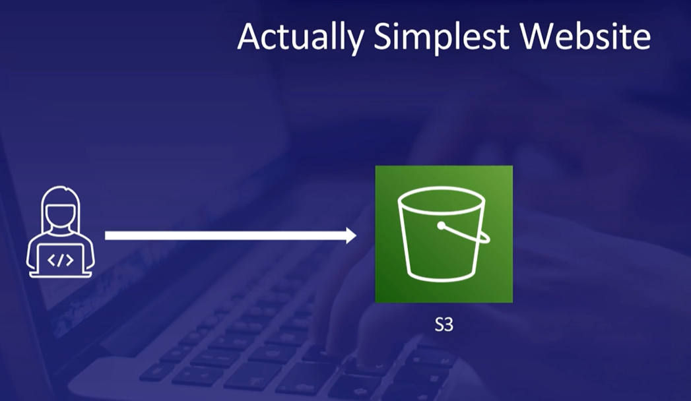

# AWS-Learning-Progress

## Day 1:

> Introduction
- What's a cloud? A collection of services (databases, virtual servers, etc) that creates a platform.
- The AWS has pay-as-you-go pricing.
- AWS Services

> Security and Identity
- AWS Identity Access Management (IAM), AWS Secrets Manager protects the secrets required, and Directory Service provides the directories for the org with specific users.
- IAM Practice Lab
1. For this lab there is an AWS account, inside of IAM there are different groups such as Admin, Developers, and Test. Each group has a certain set of permissions.
2. Three users have already been created and we can check them in the **Users Tab**, three groups were created previously named EC2-Admin, EC2-Support, and S3-Support which can be seen under **User groups Tab**.
3. The EC2-Admin has an inline policy (has permissions to describe, start, and stop EC2 instances | also a few metrics). The EC2-Support group has managed policy (has permissions to describe EC2 instances and list cloud metrics). The S3-Support has managed policy (has permissions of read-only access such as get, list, and describe objects.)
4. So now we have 3 users (U1, U2, U3) and we are going to assign these users to the above groups. First, assign the U1 to the S3-Support group (**Process: Click on the S3-Support group, click the Add Users button, select the U1, and then click on Add Users**). Then we are going to do the same for the U2 and U3. Add the U2 to the EC2-Support group and the U3 to the EC2-Admin group.
5. We can edit the permissions of any user (**Process: Click on the user, under the permissions tab expand the policy, and click on the edit**).
6. To demonstrate these permissions, **go to the dashboard copy the sign-in URL paste it into a new tab, and log in as U1. To check permissions click on S3 and click on create bucket, it fails since U1 does not have permissions and this goes the same with EC2 since U1 has read-only permissions**.
7. Similarly we log in as U2, here when we click on EC2 and click on instances it works and has more permissions than U1, but when we try to stop that instance it fails. U2 also cannot create or view the buckets.
8. log in as U3, head over to EC2, and if we try to stop the instance it stops since U3 is in the group EC2-Admin. 

## Day 2:

> Elastic Compute Cloud (EC2)
- It is a service that allows to rent virtual computers (option to choose various specifications). Everything is an instance. For example, a task that takes 24 hours can be broken down into 24 1-hour instances, which by the same cost but more efficiency.

> Containers
- The purpose of a container is to create a package of your program and all of its library and dependencies it uses, to produce an image that can be able to run any computer.

> Lambda
- It is a serverless computing service that runs your code in response to events. 
-  Storage (File, Block, and Object storage)

> Amazon S3 (object storage)
- Has different storage classes standard, standard infrequent, one zone infrequent, glacier, glacier deep archive, and intelligent tiering.
- S3 Glacier: Data archival and long-term backup. Retrieval types - Standard, Bulk, and Expedited.

> AWS Storage Gateway
- Gives access to virtual unlimited cloud storage but on-premises.

> Amazon VPC
- It lets you create a virtual network for your AWS services to exist in the local IP address range in your local network.

## Day 3:

> CloudFormation
- Used for creating or infrastructure. CloudFormation allows a DevOps engineer to automate the creation of his infrastructure.

> Machine Learning
- AWS services are Amazon Kendra, Amazon Personalize, Amazon Lookout for metrics, Amazon Forcast, Amazon Fraud Detector, Amazon Rekognition, Amazon Polly, Amazon Transcribe, and Amazon Lex.
- Amazon DeepRacer: [Link](https://aws.amazon.com/deepracer/league/)

> Case Studies

Few more architecture: [Link](https://aws.amazon.com/blogs/architecture/)

## Day 4:

> Cloud Computing
- CapEx vs OpEx: CapEx(Capital Expenditures) are upfront purchases towards fixed assets, and OpEx(Operating expenditures) are funds used to run day-by-day operations.
- Cloud Computing models: Infrastructure as a Service (building blocks), Software as a Service, and Platform as a Service.
- Cloud Deployment models: Private cloud, public cloud, and Hybrid cloud (clouds connected via VPN or direct connect).
- AWS Availability Zones: One or more discrete data centers with redundant power, networking, and connectivity in an AWS region.
- **A region is global and comprises two or more AZs. An AZ is made up of multiple data centers. Multi-AZ deployments provide high availability and fault tolerance.**

> Cloud Adoption Framework
- It has 4 domains: Technology, Process, Organization, and Product.
- It has 4 phases: Envision, Align, Launch, and Scale.
- Well-Architecured Framework Pillars: Security, Cost Optimization, Performance efficiency, Operational Excellence, Reliability, and Sustainability.
- 

> AWS Account
- Let's create an AWS account

## Day 5:

> Elastic Cloud Compute (EC2)
- EC2 pricing options: On-Demand, Spot, Reserved instances, Dedicated Hosts, and Savings Plans.
- It offers load balancing. Types of load balancers are Classic, Application (used at layer 7 for flexible application management using HTTP and HTTPS protocols), Gateway, and Network (used at layer 4 using TCP, UDP, and TLS for extreme performance and static IPs).
- Auto Scaling has two types horizontal (increases the number of instances) and vertical (increases the power of the instance)
- Connection: various ways to connect to a Linux EC2 instance: Instance connect, SSH, and System Manager. Whereas RDP is for Windows.

> Containers
- Just think of every container as a separate application. Benefits are Portability, Optional Consistency, Efficiency, Application development, and Less overhead.
- We can use containers when (microservices architecture), (we want the application to be isolated, deployed, and scaled), (support for CI/CD deployments much smoother), and (if we have several repetitive jobs).
- Services provided are
1. Elastic Container registry: it stores all the records of the container.
2. Elastic Container Service: it is fully managed and serverless and supports Docker and Docker Compose CLI.
3. Elastic Kubernetes Service: it is a fully managed open-source system and this supports Kubernetes.
- Fargate is considered serverless and is used to manage containers.

> Lambda Practice Lab
- **Go to the lambda console. Click on the Create function and fill in the details. Write a sample code to print out the name, then deploy the function, configure a test event, and click on test.**
- **We can see the results and then click on the monitor tab and click on view cloud watch logs. Here click on the latest task and there we can see the output of our program.**

> Other Compute services
- Outposts: Fully managed on-premises solutions, supports hybrid deployment models.
- Lightsail: not on-premises, allows quick launch of all resources needed for small projects, has simple UI, has bundles, and is low cost.
- Batch: allows processing large workload into smaller chunks or batches.
- Wavelength: allows users to reach application servers without leaving the 5G mobile network.

## Day 6:

> EC2 Storage options
- EBS is block-level storage used with EC2 instances, EFS is a file system scalable across multiple EC2 instances, and the instance store provides temporary block-level storage directly attached to the instance. 
- Only EBS and EFS offer durable storage solutions. In the instance store the data will be lost if the instance is interrupted. All provide high performance, EBS is particularly known for its provisioned IOPS, EFS is scalable file storage, and instance store for a high I/O operation suitable for temporary data. While EBS and EFS have costs associated with the amount of storage provisioned, the instance store comes at no additional cost, as it's included in the instance price.

> Amazon Simple Storage Service (S3)
- S3 is object storage and is globally acceptable. The bucket is our primary container; within it, we have objects or data files stored in S3 have data, a key (unique within a bucket), and metadata.** Benefits are durability, Scalability, Security, and Versatility. Use cases are Data backup, Web hosting, and Content distribution.

> S3 Storage classes
- Standard: Suitable for frequently accessed data and has high throughput and low latency.
- Intelligent-Tiering: Suitable for data of unpredictable access patterns and designed for savings.
- Standard-Infreqent access: Suitable for less frequently accessed data and requires rapid access when needed.
- One Zone-Infrequent access: Suitable for secondary backup or easily reproducible data. (stores only in one AZ)
- Glacier Instant Retrieval: Designed for immediate access to our archive data.
- Glacier Flexible Retrieval: Designed for data that is accessed only 1-2 times a year and is not immediate.
- Glacier Deep archive: Long time archive and is slow.

> S3 Practice lab
- **First search for S3 and click on the create bucket. The name of the bucket has to be globally unique and click on the enable option in the bucket versioning which allows us to download the previous version of our bucket, we can also enable encryption and finally click on create a bucket.**
- **Now click on the name, click on upload files, and select or sample file. To understand how versioning works edit or sample a file with dummy data and upload the same file to the bucket again.**
- **If we check the data in the uploaded file it has been changed. To resolve this click on our file go to the versions tab select the previous version of or file download it and again upload the downloaded file into the bucket.**

> FSx & Elastic Disaster Recovery
- FSx is tailored for Windows-based workloads. EDR is for swift recovery and minimizing disruptions. FSx offers seamless integration and EDR is important for quick recovery times and cost-effectiveness.

> Elastic Block Store (EBS)
- EBS's key features are persistent storage, highly available and durable, scalable, encrypted, and snapshot.
- EBS Volme types
- 1. Solid State Drive (SSD): faster, more expensive, and ideal for high IOPS.
- 2. Hard Disk Drive (HDD): slower, less expensive, and ideal for throughput tasks.

> AWS Storage Gateway (a hybrid storage service)
The main uses are cost-effective, secure, and seamless integration.
- S3 File Gateway: keeps your data in cloud-native formats.
- Volume Gateway: Provides block storage and offers stored and cache volumes.
- Tape Gateway: For long-term data (the archived data).
- FSx File Gateway: Extends on-premises file system.

## Day 7

- Edge location is a data center that is nearest to the user requesting your content.

> AWS Global Accelerator
- It is a networking service that sends your user traffic to the AWS's global network infrastructure enhancing your application performance and availability.
- Benefits are improved performance, simplified traffic management, security/Reliability, and consistent global user experience.

> Networking
- The Virtual Private Cloud (VPC) has two types of subnets: Public and Private. Also, VPC has an internet gateway and a Route table. Each subnet must be associated with a route table. Security in VPC: Security group(operates at instance level) and Network Access Control List (operates at subnet level, and these are stateless).

> DNS (Amazon Route 53 for AWS)
- Its features are sophisticated traffic routing (types: geolocation, latency-based, weighted round-robin routing).
- Health checks, DNS failover, and scalability & integration.

> AWS Direct Connect
- It is like a private road built exclusively for your use. A few benefits are high-speed data transfer, reduced bandwidth costs, and reliable connection.
- AWS VPN: Site-to-Site VPN (creates a secure connection between your data center or branch office and your AWS environment) and Client VPN (allows secure access to AWS resources or your private network from any location).
- Use direct connect (larger scale data transfer, consistent performance, and sensitive data) and use VPN (encrypted over public network, cost-effective, and quick & easy setup).

## Day 8

> Databases
- relational Database: organized in rows and columns, Amazon Relational Database Service.
- NoSQL Databases: organized as key-value pairs, Amazon DynamoDB.
- In-Memory Databases: stores them in the computer's main memory, Amazon ElastiCache & Amazon MemoryDB for Redis
- Graph Database: Amazon Neptune, used for fraud detection, recommendation systems, and drug discovery.

> AWS Database Migration Service
- It is simple to use, minimal downtime, reliable, and database consolidation.
- AWS Schema Conversion tool: It helps convert our source database's database schema to a format compatible with AWS target databases.

> Amazon DynamoDB
- Features: Performance at scale, fully managed, built-in security, and Backup & restore. (low latency and high performance)
- Use cases: Web and Mobile Applications, Gaming Applications, IoT applications, and E-Commerce Platforms.

> Memory-Based Databases
- They store data in RAM instead of traditional storage.
- Amazon MemoryDB for Redis: Ultra-fast performance, Data Durability. Uses Cases: Cacheing for web applications, Real-Time Analytics, Session Store for Applications, Leaderboard and Gaming, And Geospatial Data processing.

> Continuous Integration / Continuous Deployment (CI/CD)
- It aims to streamline and accelerate the software development lifecycle. Benefits: Automation (Fast, repeatable, and scalable), Manua Effort Avoided (Slow, error-prone, and inconsistent), and Small changes applied frequently (catch bugs while they are small and simple to fix).

> AWS Development tools
- AWS CodeCommit: It is like a private git repository in the cloud.
- AWS CodeBuild: It is a fully managed code service that runs a set of commands we decide. **It can refer to the code stored in the CodeCommit and use them to build deployable artifacts like packages, docker images, etc.**
- AWS CodeDeploy: It is an automated deployment service that allows us to automatically deploy software into EC2 instances, on-premises systems, and lambda.
- AWS CodePipeline: Manages and automates the process (CodeCommit -> CodeBuild -> CodeDeploy -> EC2).

- Creating a S3 bucket and uploading a file using AWS CLI
1. Open the AWS CLI, type **aws s3 mb s3://mybucket-8745468989238** and hit enter.
2. To list the buckets type **aws s3 ls**.
3. Now create a sample file by typing **echo "my new file" >> file.txt**.
4. Now to upload type **aws s3 cp file.txt s3://mybucket-8745468989238**.
5. Type **aws s3 ls s3://mybucket-8745468989238** which shows files in our bucket.

> AWS CodeArtifact
- It is an artifact repository that lets developers securely store, publish, and share software packages (Maven, NPM, and Python). It makes it easy for developers to find the software versions they need. 
- Artifacts like documentation, compiled applications, deployable packages, and libraries.

> Tight Coupling
- Coupling describes the dependencies between the components. This tight coupling is a feature in **monolithic application** where all the components in the application are interdependent. One failed component can bring the entire system down.

> Loose Coupling
- It is a feature in **microservices-based architecture** where all the components operate independently. It doesn't need to wait for other components to be completed.

> Application Integration Services

| Integration Approach    | AWS Service                       |
| :---                    |                              ---: |
| Queues                  | SQS - Simple Queue Service        |
| Notification            | SNS - Simple Notification Service |
| Events                  | EventBridge                       |

> SNS - Simple Notification Service and practice lab
- It allows us to set up, operate, and send notifications. It uses a pub and sub-model which means publish and subscribe. 
- Lab:
1. First we are going to create an SNS topic, so go to the console, search for SNS, and type the topic name in our case we are going to monitor the EC2 so let's name it EC2State and click on create topic.
2. Now we have to subscribe to the topic, so click on Create Subscription, select the topic that we have created, select a protocol which in our case Email, type the email, and click on Create Subscription. You will get a confirmation email, click it and the subscription has been created.
3. Now to test our topic, let's go to the EC2 instance select it, and copy the instance ID, then go to the cloud watch, click on the Create Alarm, click on Select metric, paste our instance ID, click on EC2 pre-instance metrics, again type for StatusCheck, then click on the StatusCheckkFailed_Instance option and hit select metric.
4. We will select the period for 1 minute, change it into Greater/Equal to 1, select "Treat missing data as bad", then hit next. Here we will select our SNS topic which is EC2State, add the notification for all three alarm state triggers, and then hit next.
5. Create a name for the alarm and click Create alarm. Then after some time, we get an email saying "Amazon CloudWatch Alarm "EC2State" in the US East (N. Virginia) region has entered the ALARM state, because "Threshold Crossed:....".

## Day 9

> Simple Queue service 
- SQS allows us to decouple the components of an application so that they are independent.
- Key features: Pull-based, multiple components can add and consume messages, messages are processed asynchronously, and guaranteed to be processed at least once.
- SQS improves performance and can scale and support millions of concurrent requests.
- Standard Queues: It uses best-effort ordering. Occasionally more than one copy of a message might be delivered.
- SQS FIFO Queues: Order is strictly preserved and there will be no duplicates.
- Short Polling returns a response immediately even if the message queue being polled is empty. (most of the responses are empty and will be charged).
- Long Polling periodically polls the queue. cost-effective.
- Simple Email Service (SES): You can send richly formatted HTML emails from the applications.

> EventBridge
- It is all about event-driven architecture. **An event is a state change**.
- It can handle scheduled events, and the rules that run on a schedule. We can set a rule to run once an hour or a day.

> Step Function
- It manages the logic of our application. It provides a visual interface, it allows us to build, and run serverless applications in a series of steps. Each step in our application executes in order, as defined by the business logic. The output of one step may act as input to the next.
- It provides **Error Handeling**. 

> AWS CloudFormation
- ** It allows us to manage, configure, and provision our AWS infrastructure as code.** Resources are defined using a template written in YAML or JSON. This allows you to quickly provision AWS resources consistently, with fewer errors.

> AWS Elastic Beanstalk
- Deploys and scales your web applications including the web application server platform. Provisions the AWS resources for you like EC2, RDS, S3, Elastic Load Balancer, etc.
- Provides Java, .NET, PHP, Node.js, Python, Ruby, Go, Apache Tomcat, IIS, Nginx, Docker, etc. OS and application server updates. Monitoring, metrics, and health checks are all included.
- Deploying an application using Elastic Beanstalk
1. Create a service role for Elastic Beanstalk.
2. Create an EC2 instance role for Elastic Beanstalk.
3. Upload the provided code.

> X-ray
- It is a tool that helps developers analyze and debug distributed applications—allowing you to troubleshoot the root cause of performance issues and errors.
- The X-ray service map provides an end-to-end view of requests traveling through your application.

## Day 10

> AWS Snow Family
- Migrating terabytes or petabytes of data to AWS. It is a Data Transfer Solution.
- Snowball: Great option if you've got at least 10TB of data to migrate.
- Snowball: Great option if you've got at least 10TB of data to migrate and you need local computing.
- Snowmobile: Great option if you've got more than 10PB of data to migrate.
- SnowCone: Small and portable, military-grade 8TB HDD or 14TB SSD storage and weighs under 5 lbs. 

> AWS Transfer Family
- Business-to-business file transfer using protocols like SFTP, AS2, FTPS, and FTP. Files are transferred into and out of AWS storage like S3 or EFS. 
- File sharing and transfer with external parties.

> AWS DataSync
- It is designed to move large amounts of data (like 500TB). It enables high data throughput, automated, and pay-per-GB transfer.
- Benefits: Securely migrate all your data to AWS, cost-effectively replicate the data, archive historical data to low-cost AWS storage, and support hybrid or multi-cloud workflow.

> AWS Application Discovery Service
- It gathers data about your existing on-premises application servers and databases. We install an agent on each server to collect the data. 
- A virtual appliance can be deployed on VMware vCenter systems to avoid using an agent.
- The data includes serverless inventory, configuration, operating system, capacity usage, and networking.
- This data can be used to develop a migration plan to move applications and data to AWS.

> AWS Application Migration Service
- It is an automated Lift-and-Shift service, that automatically migrates applications to AWS without modifying them.
- The AWS Replication agent is installed on the source server and replicates to a new server in AWS.
- Migrate applications that are running on physical servers, virtual servers, other cloud providers, and other AWS accounts or regions.

> AWS Migration Hub
- It is a central location to gather application and server inventory information.
-It is integrated with AWS Application Discovery Service, AWS Application Migration Service, and AWS DMS. 
-It allows us to group servers so that you can plan and track the progress of your migration.

> Redshift and Redshift serverless
- It is a data warehousing service. features: massively parallel processing, automated data management, and designed for Online Analytical Processing (OLAP).
- It allows us to store huge amounts of data. Redshift serverless has no infrastructure to manage.
- Use cases: complex querying and reporting, data lake integration, and operational analytics.

> Kinesis
- A family of services that enables you to collect, process, and analyze streaming data in real-time.
- Data generated continuously by thousands of data sources (stocks, game data, social media feeds, IoT sensors, log files, etc.).

> Kinesis Data Firehose
- Firehose: Capture, transform, and load data streams into AWS data stores to enable near real-time analytics with BI tools.

> Amazon Athena
- Athena enables you to run standard SQL queries on data stored in S3. It is serverless, an interactive query service, without complex ETL processes, and works directly with data stored in S3.
- Use cases include querying log files or generating reports from S3 data.
- Using Athena to query data
1. Configure CloudTrail to create some log data.
2. Create an S3 bucket for Athena results.
3. Query the data using Athena.

> AWS Glue
- It is a serverless data preparation and integration service. Discovers and catalogs our data. Performs ETL(Extract, Transform, and Load).
- It prepares your data for analytics and ML. 

> AWS Data Exchange
- It lets you securely exchange and use data that is provided by a third party on a subscription basis. The data products can be financial services, healthcare, weather, manufacturing, and telecommunications. It lets us create our own/personal data product.

> Amazon Elastic Map Reduce (EMR)
- It is a big data platform with large-scale parallel data processing and petabyte-scale interactive analysis.
- Supports multiple types of data: Structured, Semi-structured, and unstructured data.
- It is a fully managed big data solution. Supports open-source technologies like Apache Spark, Apache Hive, Presto, and Hadoop. Its use cases include finding patterns in genomic data, identifying preferences from clickstream, or analyzing log data.

> Amazon OpenSearch
- It is fully managed Elastisearrch, based on open-source technology. Compatible with industry-standard Elastisearch open-source APIs, Logstash, and Kibana.
- Ingest data from AWS services like CloudWatch Logs, S3, and DynamoDB.

> Amazon Managed Streaming for Apache Kafka (MSK)
- It is a widely used open-source technology to build a real-time data streaming pipeline.
- It can process streams of events from hundreds of event sources. An example use case is to track and analyze stock market data in real time.

> Amazon Quicksight
- It is a SaaS model business analytics service that lets you make better decisions based on your data.
- It creates dashboards to gain business insights. It lets us visualize our data (bar graphs, scatter plots, pie charts, etc).
- Use cases: Analyzing sales performance, Application traffic data, and marketing campaign analysis.

## Day 11

> Amazon SageMaker
- It is a fully managed ML platform. It lets you import (from S3, Athena, etc.) and prepare the data, build your model, train the model using optimized infrastructure, and deploy the model (like EC2, etc.).

> Amazon Kendra
- It is an intelligent Search service. It uses natural language processing and allows a customized search.
- Data sources include S3, FSx, RDS, Aurora, Websites, Google drives, Github, etc.
- The questions we can ask can be fact-based or descriptive.

> Amazon Lex
- Lex allows you to build conversational interfaces using natural language models in your application.
- Features: Multi-Platform compatibility, handles speech or text input, etc.
The main use is to provide a helpful customer handling chatbox on our website.

> Amazon Polly
- It uses deep learning to generate realistic-sounding speech, from the text we provide.
- We provide the text and Polly will generate speech that can be streamed, downloaded, or saved to S3.

> Amazon Comprehend
- It used NLP, and ML to process text to discover insights, meanings, etc.
- It can perform sentiment analysis from social media feeds and also provides intelligent search.

> Amazon Textract, Transcribe, Translate
- A group of services that use ML to process text.
- Textract extracts information from documents, Transcribe is a speech-to-text service, and Translate is a language translation service.

> Amazon Rekognition
- It performs image and video analysis. It can perform content moderation to identify harmful or offensive images, identify verification, and identify objects and text in images.

> Monitoring and Logging
- Collecting and monitoring these is critical to the health of the AWS ecosystem.
- Metrics: Numerical representations of the things like capacity and demand, tracked over time.
- Logs: A record of what has happened, to make sense of errors or security events.
- Configurations: Settings and guidelines across all of your cloud resources.

> CloudWatch vs CloudTrail
- CloudWatch
1. Gives visibility to cloud resources and applications.
2. Tracks metrics in dashboards.
3. Stores logs from many sources.
4. Triggers events with CloudWatch alarms.
5. CloudWatch lets you watch your cloud resources as your AWS ecosystem evolves.

- CloudTrail
1. Provides accountability for actions taken in your account.
2. Centralize activity logs across regions in an S3 bucket.
3. Tracks only API activity in your AWS account.
4. CloudTrail creates a trail of breadcrumbs for any action in your account.

> Tags (Managing Resources)
- They are key-value pairs, they help you sort and visualize your cloud resources on AWS.

> Systems Manager
- Groups resources on AWS, on-premises, or on other cloud platforms. View aggregated operational data of resource group.
- **Systems Manager Parameter Store: It can store sensitive data like passwords, database strings, license keys, etc.**

> AWS Health Dashboard
- The best way to know about service outages in your AWS account is by using the AWS health dashboard or Health API.
- **Trusted Advisor** is a one-stop shop for best practice advice. It provides advice on Performance, Cost Optimization, Service Limits, Fault Tolerance, Operational Excellence, and Security.

> Auditing on AWS
- Auditing is the continuous act of monitoring passive configurations for security and best practices.
- **AWS Config**: Leverages pre-defines recommendations or create custom rules.
- Audit Manager: Centralize audit data from AWS config and security services. Find root causes of noncompliance and generate reports.
- **The AWS Well-Architected Tool**: Assess your workloads, learn about best practices, and generate action plans.

> Additional Services
- Amazon Connect: It is a business service that allows you to provision a contact center in the cloud.
- WorkSpaces and AppStream are end-user services that enable you to give access to virtual desktops and applications hosted on AWS.

## Day 12

> Security (Revision & Bigger Picture)
- **The shared responsibility Model**

- **The customer is responsible for security IN the cloud.**
- **The AWS is responsible for the security OF the cloud.**
- The permissions written are called policies.
- IAM Access Analyzer: Identify resources with eternal access, validate IAM policies, and generate IAM Policies based on usage.
-IAM Policy Simulator: Test new IAM policies before granting them to users, user groups, and roles.
- An IAM role can be assumed by any resource on AWS and grant access to other resources. 

> IAM Identity Center (Federated Identity)
- It allows AWS users to leverage Single Sign-On to assume a role each time they log in temporarily

> Amazon Cognito (Web Federated Identity)
- Create user pools and grant temporary keys to customers to give access to your application.

> AWS Directory Service
- This service enables you to connect your AWS ecosystem with an existing Microsoft Authenticated Directory.

> AWS Security Token Service (STS)
- With this, you can grant the individual temporary access, allowing them to access a temporary role, and then they can access the AWS resources (It's like read-only access for third-party audit).

> Network Security Services
- AWS Network Firewall: This not only filters based on origin but can also define complete rules to inspect traffic within our VPCs.
- AWS Web Application Firewall: It protects your web applications from common exploits.
- AWS Shield: It protects from DDoS Attacks. Shield Standard protects your AWS resources from DDoS attacks at no extra cost. Shield Advanced provides expanded protection and access to a 24/7 DDoS response team.
- AWS Firewall Manager: It helps you administer our network security from a single service.

> Security Confusion
- AWS Trusted Advisor: It gives you advice or best practice suggestions on all kinds of different things.
- Amazon GuardDuty: It collects logs from around AWS and uses ML to detect threats intelligently.
- Amazon Detective: It helps you investigate security events that have already happened
- Amazon Inspector: It continuously scans your workloads for software vulnerabilities and network exposure.

> AWS Organizations
- It allows you to administer multiple AWS accounts from a single point, consolidating cost while organizing and limiting access to resources.
- You can use Config rules to detect non-compliant resources across your organization.
- AWS Control Tower: allows you to automate account creation and the application of best-practice Config rules and Service Control Policies(SCPs).

> Compliance Programs
- AWS Artifact: It is a repository of compliance documents, provides them to regulators, and informs your cloud architecture.
- Secrets Manager rotates the password.
